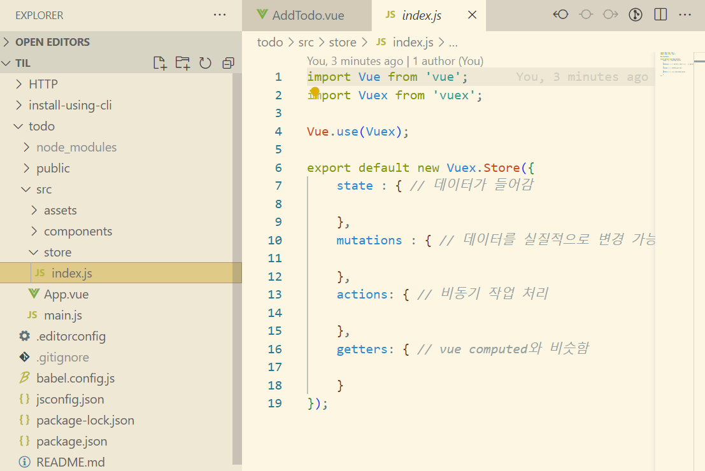

# Vuex

## Setting
1. Vuex install

    ```bash
    > npm i vuex
    ```


2. src 경로 아래 store 폴더 생성


3. src/store/index에 다음과 같이 작성
```javascript
import Vue from 'vue';
import Vuex from 'vuex';

Vue.use(Vuex);

export default new Vuex.Store({
    state : { // 데이터가 들어감

    },
    mutations : { // 데이터를 실질적으로 변경 가능함

    },
    actions: { // 비동기 작업 처리

    },
    getters: { // vue computed와 비슷함

    }
});
```

1. src/main.js 파일에 설정한 Vuex import

```javascript
import Vue from 'vue';
import App from './App.vue';
import store from './store' // 모듈 가져오기

Vue.config.productionTip = false;

new Vue({
  store, // Vuex 모듈 넣기
  render: (h) => h(App),
}).$mount('#app');

```

## 1. State

## 2. 